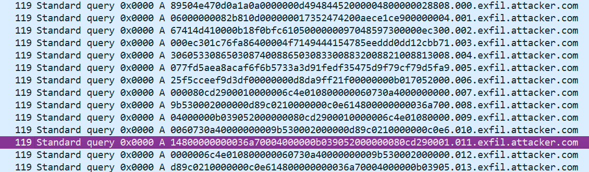
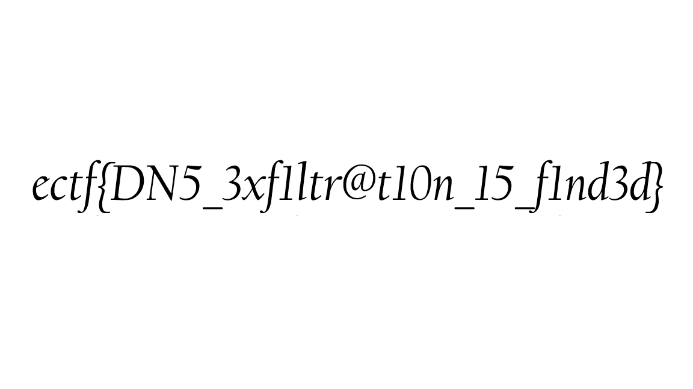

# Forensics Challenge 1 (Extraction) solution
when i open up the pcap file in wireshark, i see a bunch of exfil files. after some research, i now know that an exfil file that contains data that has been exfiltrated, meaning it has been unauthorizedly copied, transferred, or retrieved from a secure system or device. i now know that the numbers in the pcap are probably some sort of data, and i have to extract them. 

so i extract these numbers by writing some code, then i throw it into cyberchef to decode it, which gives me an image, which is the flag: 

so the flag is `ectf{DN5_3xf1ltr@t10n_15_f1nd3d}`!