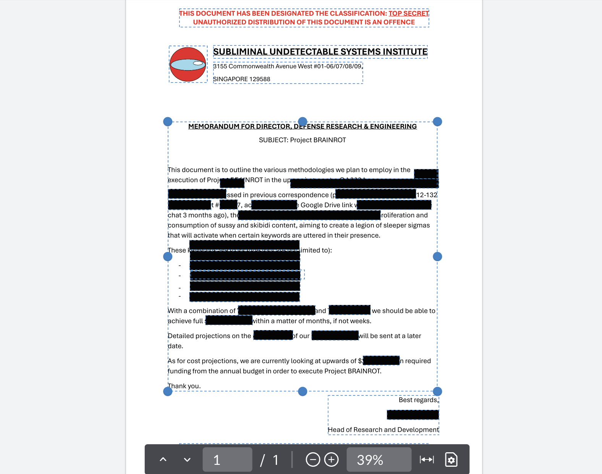
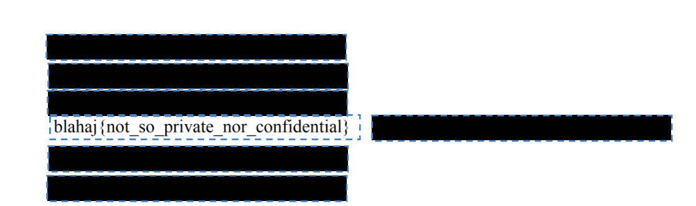

# Challenge 2 (REDACTION) solution
when i first click into the pdf, i am greeted with a bunch of black boxes and i probably have to remove them to get a flag. i throw the pdf into a free online pdf editor called "ilovepdf". 

i notice a small text box inside of the larger one, but i can't quite access it, so i just nuke the entire big wall of text. then i remove that one black box that's suspiciously placed here;

to reveal the flag, 

`blahaj{not_so_private_nor_confidential}`!