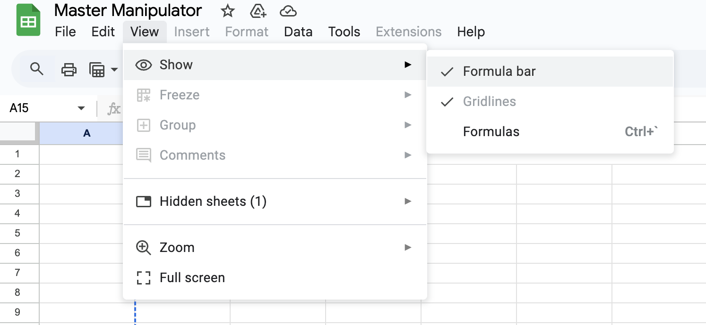
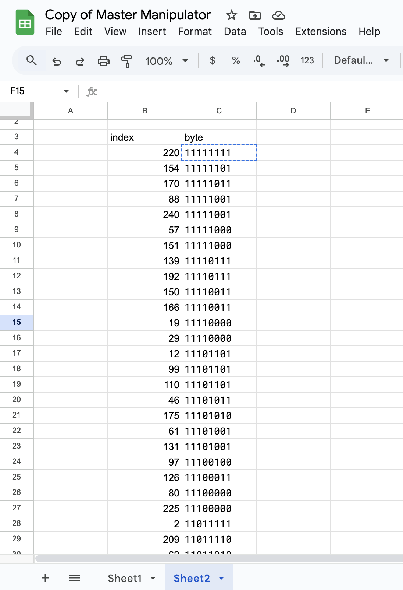

# Challenge 2 (Sheety manipulation) solution
first, i open up the file in google docs, which gives me a link to a google sheets. upon entering the google sheets, i'm greeted with an empty sheet and some funny numbers in the column selection.

`496e206469676974616c206669656c64732077686572652064617461206c6965732c0d0a5365637265742070616765732062656e6561746820636c65617220736b6965732e0d0a43656c6c7320656e7477696e652c206d7973746572696573206665656c2c0d0a4c6179657273206f66207365637265747320746865792072657665616c2e`

which is decoded into:

`In digital fields where data lies,
Secret pages beneath clear skies.
Cells entwine, mysteries feel,
Layers of secrets they reveal.`

when i run it through dcoder's cipher identifier, it says it is ascii encoding. so i then run it through the ascii decoder.

i hovered my mouse over "view" and realised there was a hidden sheet. 

so that's why the challenge asked me to make a copy of the document! i make a copy of the document and i am greeted with this really long string of indexes and bytes, as well as another funny encoded message.

`THVya2luZyBzaGFkb3dzLCBzZWNyZXRzIHBsYXksDQpTdGVhbHRoeSB3aGlzcGVycyBvbiBkaXNwbGF5Lg0KQklUUyBhbGlnbmVkLCBMRUFTVCBpbiBTSUdodCwNCkdsZWFtcyBvZiBzZWNyZXRzLCB2ZWlsZWQgaW4gbGlnaHQu`

this time, when i run it through the cipher identifier, it is base64 encoding. so i go ahead and run it through the base64 decoder, which decodes into this:

Lurking shadows, secrets play,
Stealthy whispers on display.
BITS aligned, LEAST in SIGht,
Gleams of secrets, veiled in light.

the letters are capitalised funny. i wonder if this is a clue? BITS, LEAST, SIG, could mean least significant bit. yeah! that's it! 

so i sort the sheets by smallest index to largest index, using data > sort sheet (selecting both cols b and c) > a-z, then i download the hidden sheet as a csv.

then, i code up this notebook to select the least significant bits of each binary number and add them to a string to get the flag. 

i get this string:

`010010010101001101000011001100100100001101010100010001100111101101011001001100000111010101011111011000010110110000110001011001110110111000110011011001000101111101110100011010000011001101011111011000100011000101110100011100110010000101111101`

which i chuck into cyberchef to get me the flag, `ISC2CTF{Y0u_al1gn3d_th3_b1ts!}`!