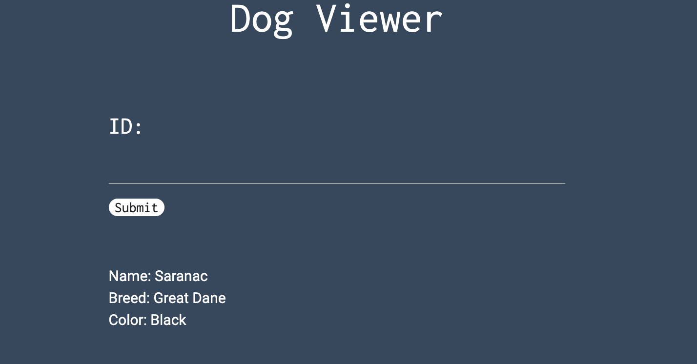
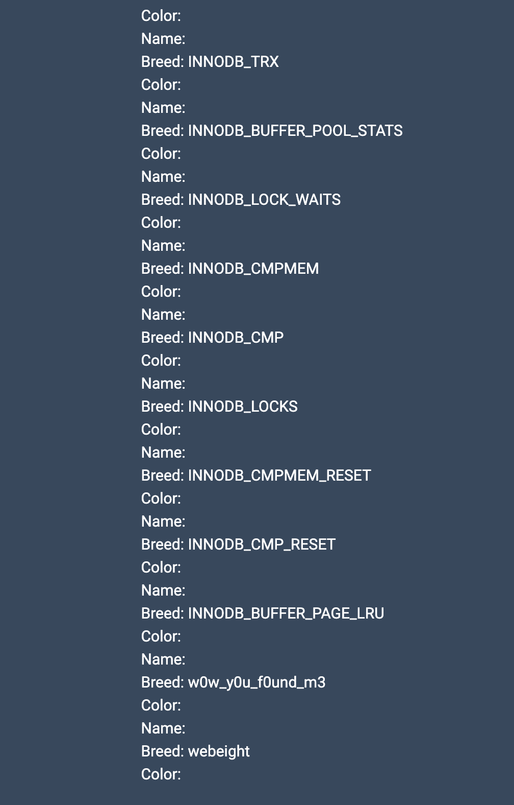
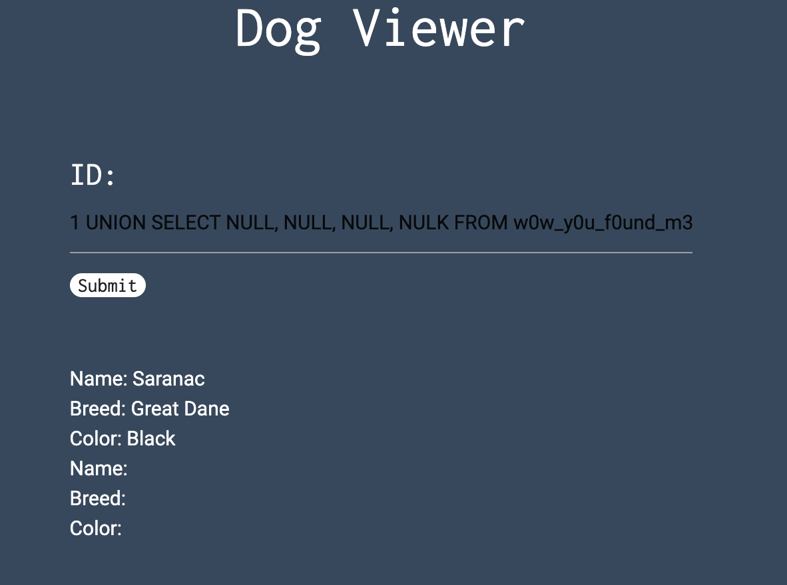
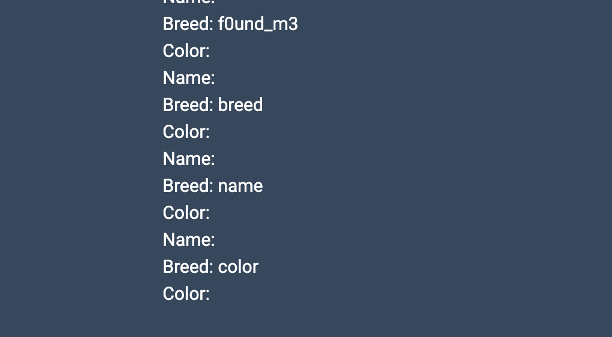
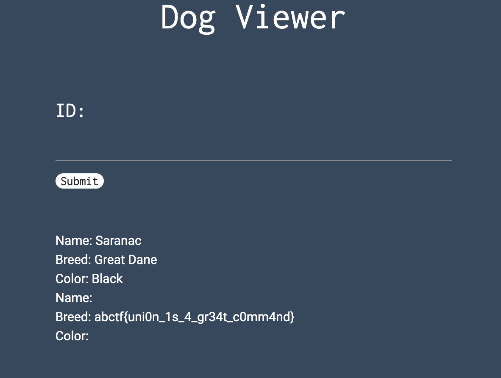

# inj3ction time solution

http://web.ctflearn.com/web8/

clicking the link brings me to this website for viewing dogs. 

in the challenge, it is given that "UNION might be a helpful command", so i am sure this is an SQL injection challenge. and UNION is probably one of the commands i'm going to need to use.

i'll enter something like "1=1" into the website.

IMAGE

it gives me the these things, the dog's name, breed and colour. since it is stated that UNION is a useful command, i'll try using it now. i want to know how many columns there are in this table, so i will brute force it with a `1 UNION SELECT NULL * however many times it takes for me to get the number of columns`.

IMAGE

IMAGE

IMAGE

IMAGE

when i enter `1 UNION SELECT NULL, NULL, NULL, NULL` it gives me the homepage, which means there are 4 columns in this database. 

next, i use `1 UNION SELECT table_name, NULL, NULL, NULL FROM information_schema.tables` which gives me all available tables. 

i find this very suspicious table with the name `w0w_y0u_f0und_m3`. i want to view all the columns of this table, so i use `1 UNION SELECT * FROM w0w_y0u_f0und_m3` but it didn't work. i also tried using `1 UNION SELECT NULL, NULL, NULL, NULL FROM w0w_y0u_f0und_m3` but it didn't work either.

i then try using `1 UNION SELECT COLUMN_NAME, NULL, NULL, NULL FROM information_schema.columns` to get all column names in this entire database. i get this very suspicious table name `f0und_m3`.

ah! so that must be the column with the flag inside of the `w0w_y0u_f0und_m3` table. so now i'll enter `1 UNION SELECT f0und_m3, NULL, NULL, NULL FROM w0w_y0u_f0und_m3` to get where the flag is!

and voila, the flag is: `abctf{uni0n_1s_4_gr34t_c0mm4nd}`!