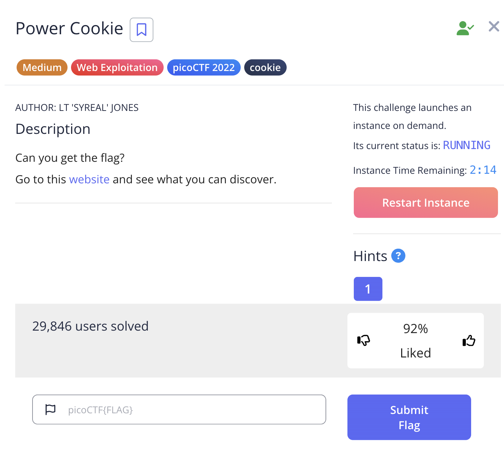

# power cookie solution


the challenge requires me to go to a website after launching the instance.

it has "cookie" in its name, so i can stretch and deduce that it has something to do with cookies.

on the website, i see this:


there is button, so i click, which brings me here:


i inspect this page by;
1. right clicking and then clicking inspect


flag:```picoCTF{gr4d3_A_c00k13_5d2505be}```