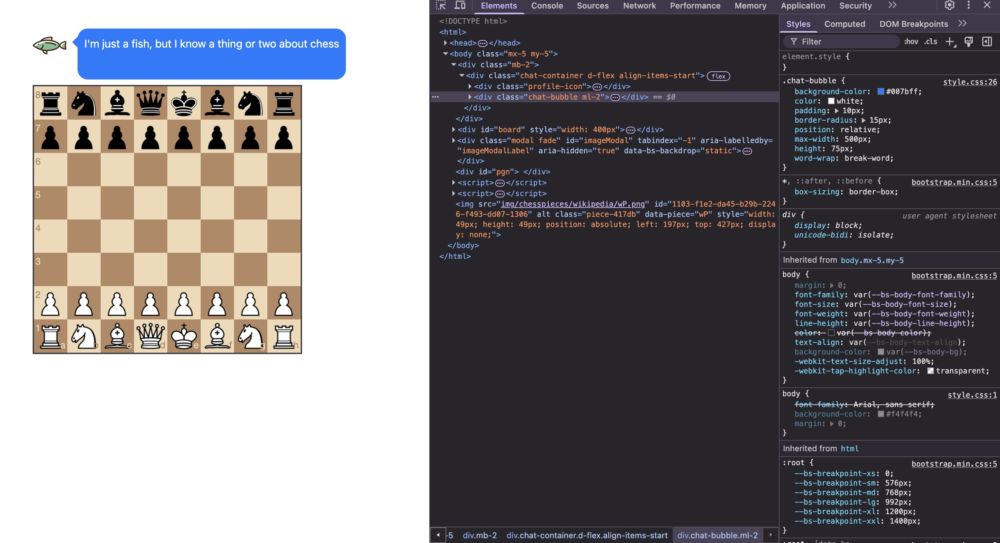
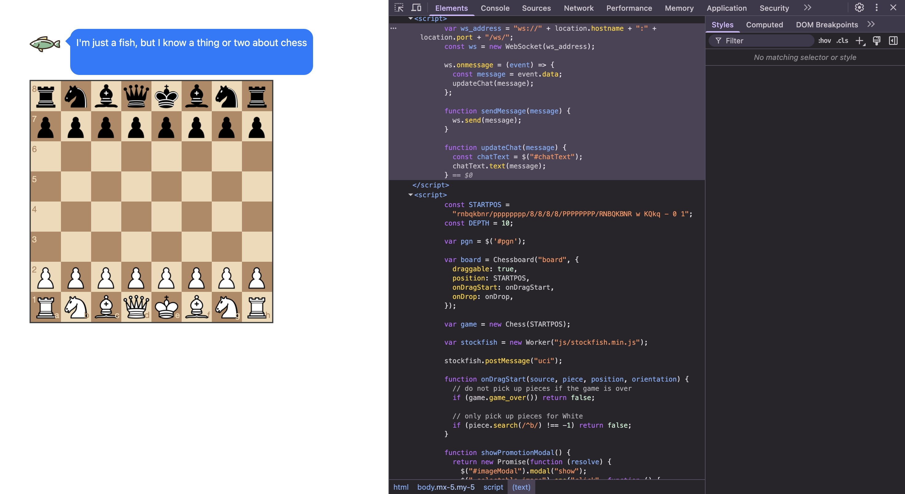
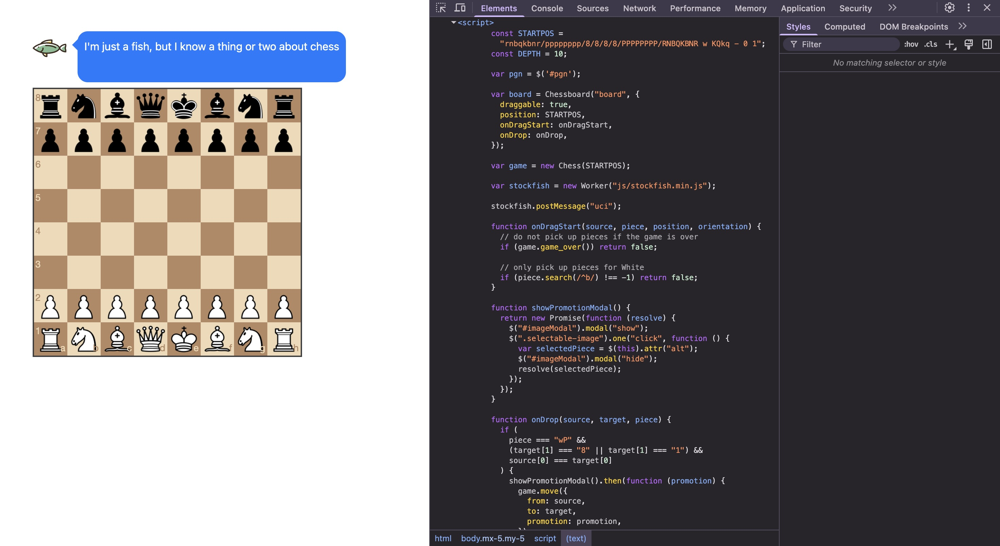
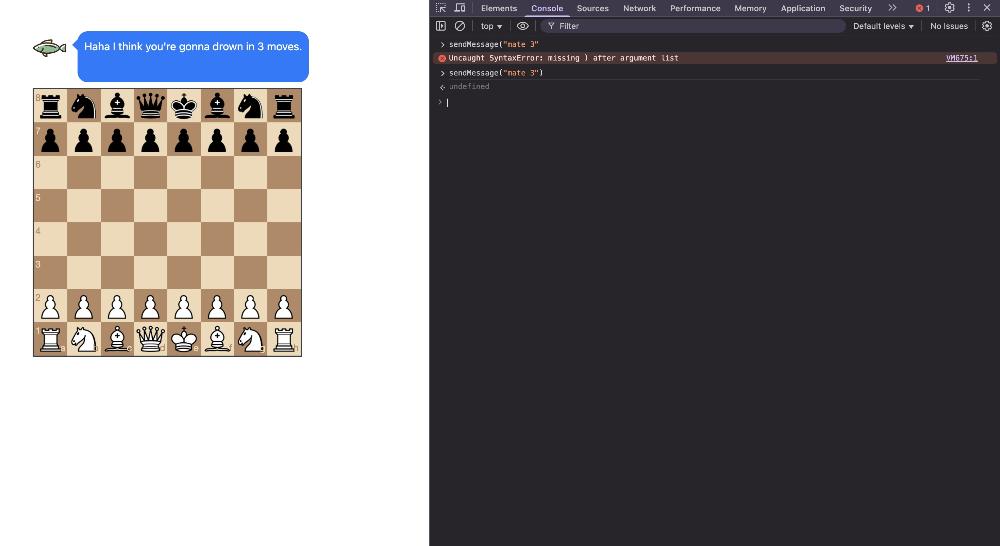
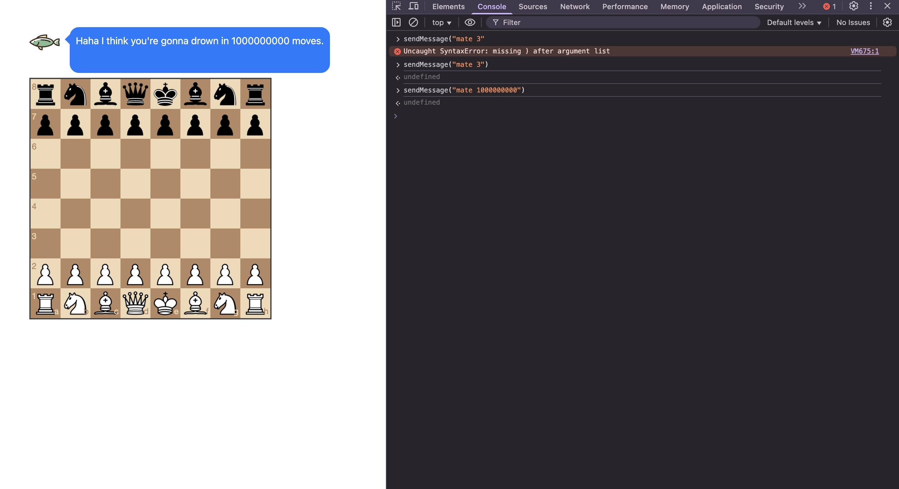
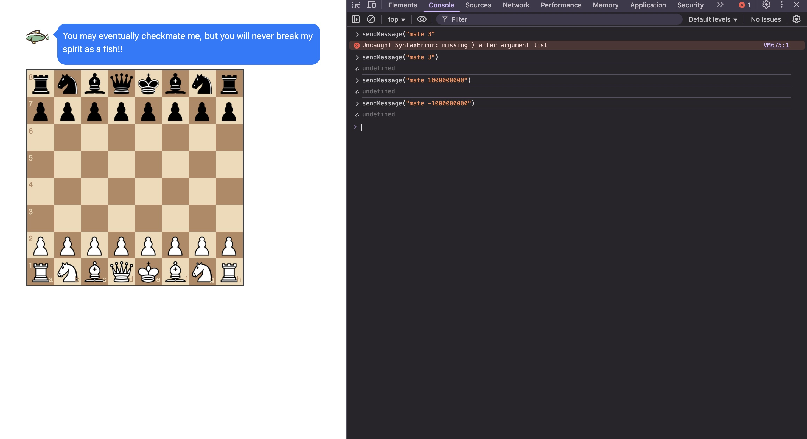
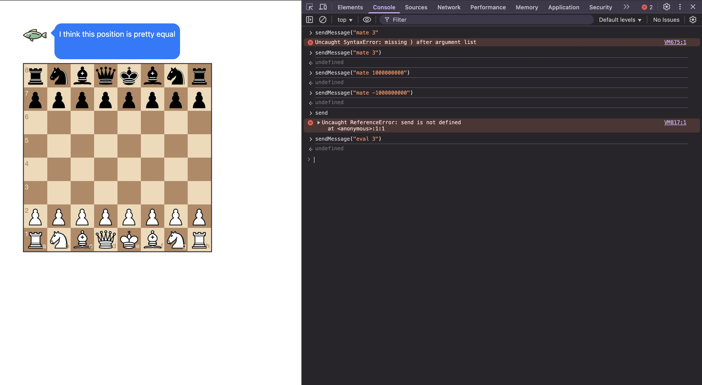
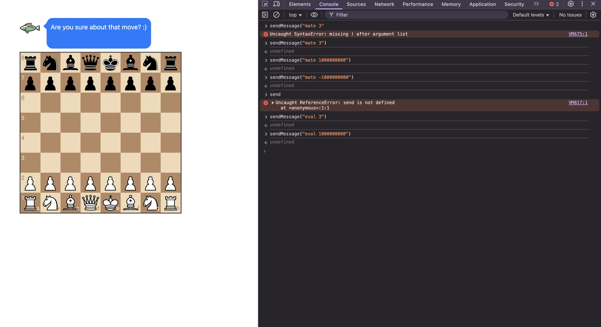
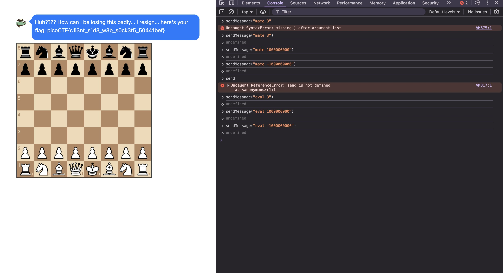

# picoCTF websockfish solution

https://play.picoctf.org/practice/challenge/480?category=1&difficulty=2&page=1

first, i'm brought to this website with a chessboard and a fish. when i make a move, it will comment on it. that's not very useful. i inspect the website because of course this is a web challenge.

i see this `<script>...</script>` thing so i click it, and lo and behold, there's code.







so there's some java code, which is

```
      var ws_address = "ws://" + location.hostname + ":" + location.port + "/ws/";
      const ws = new WebSocket(ws_address);

      ws.onmessage = (event) => {
        const message = event.data;
        updateChat(message);
      };

      function sendMessage(message) {
        ws.send(message);
      }

      function updateChat(message) {
        const chatText = $("#chatText");
        chatText.text(message);
      }
    
```

and

```

      const STARTPOS =
        "rnbqkbnr/pppppppp/8/8/8/8/PPPPPPPP/RNBQKBNR w KQkq - 0 1";
      const DEPTH = 10;

      var pgn = $('#pgn');

      var board = Chessboard("board", {
        draggable: true,
        position: STARTPOS,
        onDragStart: onDragStart,
        onDrop: onDrop,
      });

      var game = new Chess(STARTPOS);

      var stockfish = new Worker("js/stockfish.min.js");

      stockfish.postMessage("uci");

      function onDragStart(source, piece, position, orientation) {
        // do not pick up pieces if the game is over
        if (game.game_over()) return false;

        // only pick up pieces for White
        if (piece.search(/^b/) !== -1) return false;
      }

      function showPromotionModal() {
        return new Promise(function (resolve) {
          $("#imageModal").modal("show");
          $(".selectable-image").one("click", function () {
            var selectedPiece = $(this).attr("alt");
            $("#imageModal").modal("hide");
            resolve(selectedPiece);
          });
        });
      }

      function onDrop(source, target, piece) {
        if (
          piece === "wP" &&
          (target[1] === "8" || target[1] === "1") &&
          source[0] === target[0]
        ) {
          showPromotionModal().then(function (promotion) {
            game.move({
              from: source,
              to: target,
              promotion: promotion,
            });

            board.position(game.fen());
            pgn.html(game.pgn());
            window.setTimeout(makeBestMove, 250);
            return "snapback";
          });
        }

        var move = game.move({
          from: source,
          to: target,
        });

        // Illegal move
        if (move === null) return "snapback";

        pgn.html(game.pgn());
        window.setTimeout(makeBestMove, 250);
      }

      function makeBestMove() {
        var moves = "";
        var history = game.history({ verbose: true });
        for (var i = 0; i < history.length; i++) {
          var move = history[i];
          moves +=
            " " + move.from + move.to + (move.promotion ? move.promotion : "");
        }

        stockfish.postMessage("position fen " + STARTPOS + " moves" + moves);
        stockfish.postMessage("go depth " + DEPTH);
      }

      stockfish.onmessage = function (event) {
        var message;
        // console.log(event.data);
        if (event.data.startsWith("bestmove")) {
          var bestMove = event.data.split(" ")[1];
          var srcSq = bestMove.slice(0, 2);
          var dstSq = bestMove.slice(2, 4);
          var promotion = bestMove.slice(4);

          game.move({ from: srcSq, to: dstSq, promotion: promotion });
          board.position(game.fen());
        } else if (event.data.startsWith(`info depth ${DEPTH}`)) {
          var splitString = event.data.split(" ");
          if (event.data.includes("mate")) {
            message = "mate " + parseInt(splitString[9]);
          } else {
            message = "eval " + parseInt(splitString[9]);
          }
          sendMessage(message);
        }
      };
```

when i scroll down, i see these very suspicious lines:
```
          var splitString = event.data.split(" ");
          if (event.data.includes("mate")) {
            message = "mate " + parseInt(splitString[9]);
          } else {
            message = "eval " + parseInt(splitString[9]);
          }
          sendMessage(message);
```

`splitString` splits the incoming message string (event.data) into an array of words, using spaces as separators. 

what this function is doing (after a little bit of research) is essentially, if you send a message "mate" with an integer behind it, it will change the int into a string. so if you send something like "mate 10", it will take the number behind it and turn it into a string. 

i know that developer tools in browsers (like the console) can be used to interact with and debug WebSocket connections, so i will test this function out by sending it through the console.

i send something like `sendMessage("mate 3")`:



the fish just tells me how many moves i'm going to go down in:

if i use a giant number like `sendMessage("mate 1000000000")`:



and what if i use a negative number, like `sendMessage("mate -1000000000")`?



seems like it won't work, so "mate" + integer is essentially useless.

looking down, if the message doesn't contain "mate",  it will check for "eval" to check for the score. (that's my guess at least) so i'll try using "eval" next. 

sending a message to the server using `sendMessage("eval 3")`:



has the fish tell me that the position is pretty equal.

so what about the same thing, with a really big number like `sendMessage("eval 1000000000")`?



the fish says "are you sure about that move", meaning it wasn't correct.

okay, last approach is to use `sendMessage("eval -1000000000")`, just like with "mate".



this gets me the flag, which is `picoCTF{c1i3nt_s1d3_w3b_s0ck3t5_50441bef}`!